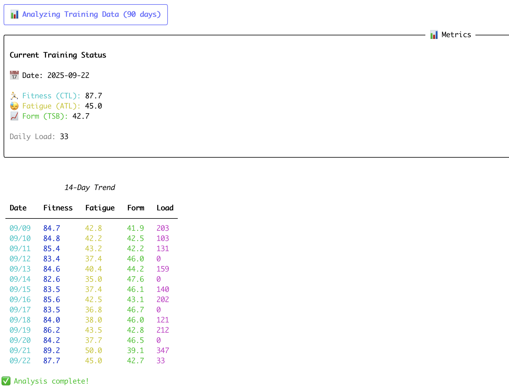
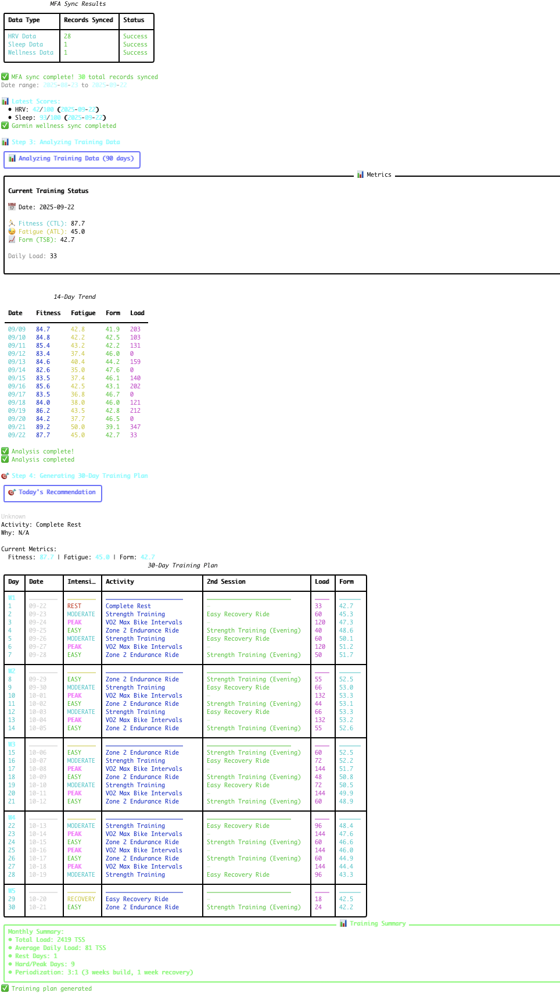
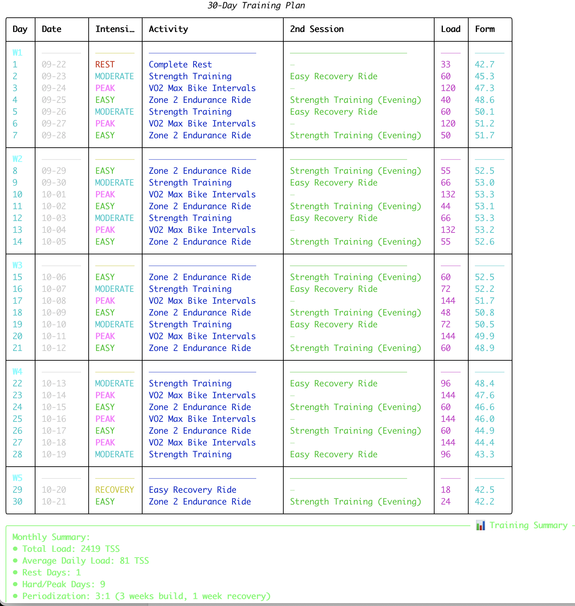
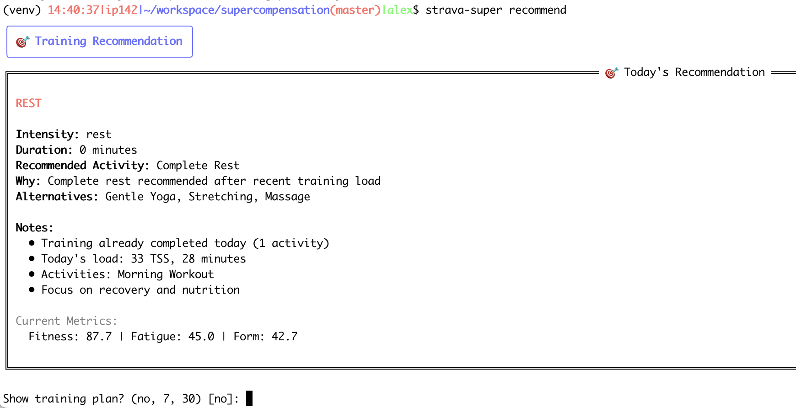
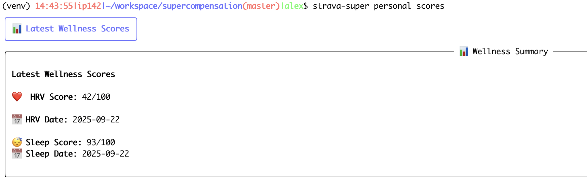

# 🏃‍♂️ Strava Supercompensation Tool

A comprehensive Python tool that analyzes your training data using advanced sports science principles to provide Olympic-level training recommendations based on supercompensation theory.



## 🚀 Features

### 📱 **Multi-Platform Data Integration**
- **Strava Integration**: Automatic synchronization of activities via OAuth2
- **Garmin Connect Integration**: HRV, sleep quality, stress levels, and wellness data
- **RENPHO Body Composition**: Smart CSV auto-discovery with athletic analysis focused on power-to-weight ratios
- **Omron Blood Pressure**: Health monitoring integration for cardiovascular tracking
- **Multi-Sport Support**: Running, cycling, hiking, strength training, rowing, swimming, and more
- **Environmental Integration**: Real weather data integration for training optimization

### 🧠 **Advanced Sports Science**
- **Banister Impulse-Response Model**: Fitness-Fatigue modeling with supercompensation
- **German Sports Science**: Multi-system recovery analysis (Neural, Energetic, Metabolic, Structural, Adaptive)
- **Athletic Body Composition Analysis**: Power-to-weight optimization, hydration stability tracking, lean mass monitoring
- **HRV Baseline Analysis**: Heart Rate Variability monitoring for recovery optimization
- **Periodization State Tracking**: Real calendar-based training cycle management
- **Overtraining Detection**: Advanced algorithms to prevent burnout and optimize supercompensation

### 🎯 **Olympic-Level Training Intelligence**
- **Sport-Specific Recommendations**: Not just intensity, but specific activity suggestions
- **Double Session Training**: Smart combinations based on Olympic training methodology
- **30-Day Periodized Plans**: Complete training cycles with BUILD/PEAK/RECOVERY phases
- **Environmental Adaptation**: Weather-aware training adjustments

### 💻 **Professional Interface**
- **Rich CLI Interface**: Beautiful terminal interface with progress tracking
- **Complete Workflow Automation**: Single command for full analysis pipeline
- **Real-Time Metrics**: Live fitness, fatigue, and form tracking
- **Comprehensive Reporting**: Detailed training summaries and insights

## Installation

### Prerequisites

- Python 3.10 or higher
- Strava API application credentials

### Setup

1. Clone the repository:
```bash
git clone https://github.com/yourusername/strava-supercompensation.git
cd strava-supercompensation
```

2. Create a virtual environment:
```bash
python -m venv venv
source venv/bin/activate  # On Windows: venv\Scripts\activate
```

3. Install dependencies:

For basic functionality:
```bash
pip install -r requirements-minimal.txt
```

For full features including visualization:
```bash
pip install -r requirements.txt
```

For development:
```bash
pip install -r requirements-dev.txt
```

Or install as a package:
```bash
pip install -e .  # Basic installation
pip install -e ".[dev]"  # With development dependencies
pip install -e ".[viz]"  # With visualization support
```

4. Configure Strava API credentials:
```bash
cp .env.example .env
```

Edit `.env` and add your Strava API credentials:
- `STRAVA_CLIENT_ID`: Your Strava application's Client ID
- `STRAVA_CLIENT_SECRET`: Your Strava application's Client Secret

To get these credentials:
1. Go to https://www.strava.com/settings/api
2. Create a new application
3. Copy the Client ID and Client Secret

## 🚀 Quick Start

### 1. Authentication
```bash
strava-super auth
```
Opens browser for Strava OAuth2 authorization.

### 2. Complete Training Analysis (One Command!)
```bash
strava-super run
```
This single command automatically:
- 📱 Syncs 30 days of Strava activities
- ⌚ Syncs 30 days of Garmin wellness data (HRV, sleep, stress)
- ⚖️ Auto-imports RENPHO body composition data from CSV files
- 🩺 Imports Omron blood pressure measurements
- 📊 Analyzes all training data with advanced models
- 🚨 Detects overtraining risk and provides recovery recommendations
- 🎯 Generates 30-day periodized training plan



## 📋 Usage Examples

### 🔄 **Complete Workflow (Recommended)**
```bash
# Full 30-day analysis with training plan
strava-super run

# Custom timeframes
strava-super run --strava-days 7 --garmin-days 30 --plan-days 7

# Skip specific data sources
strava-super run --skip-garmin  # Only Strava data
```

### 📱 **Individual Commands**
```bash
# Sync Strava activities
strava-super sync --days 30

# Sync Garmin wellness data
strava-super personal sync-mfa --days 30

# Analyze training data
strava-super analyze

# Get today's recommendation
strava-super recommend

# View system status
strava-super status
```

### ⌚ **Garmin Integration**
```bash
# Test Garmin connection
strava-super personal test-mfa

# Sync with MFA code prompt
strava-super personal sync-mfa --days 30

# View wellness scores
strava-super personal scores
```

### 🏃‍♂️ **Multi-Sport Analysis**
```bash
# Multi-sport training distribution
strava-super multisport analyze --days 30

# Sport-specific recovery metrics
strava-super multisport recovery --days 14
```

### ⚖️ **RENPHO Body Composition Analysis**
```bash
# Auto-discover and import all RENPHO CSV files in current directory
strava-super renpho import-csv

# Import from specific directory
strava-super renpho import-csv --directory ~/Downloads

# Import specific CSV file
strava-super renpho import-csv --csv-path "RENPHO Health-Export.csv"

# Athletic performance trends analysis
strava-super renpho trends --days 60

# View enhanced training log with body composition data
strava-super analyze --days 60
```

**RENPHO Features:**
- **🔍 Smart CSV Auto-Discovery**: Automatically finds RENPHO CSV files by column structure
- **🌍 Multi-Language Support**: German and English CSV formats supported
- **🏃‍♂️ Athletic Focus**: Power-to-weight ratios, hydration stability, lean mass tracking
- **📊 Training Log Integration**: Weight, body fat %, and hydration shown in 60-day log
- **🎯 Performance Metrics**: Recovery scores, metabolic efficiency, training adaptation indicators



## 📊 Enhanced Training Log

The 60-day comprehensive training log now includes athletic body composition metrics:

```
                       60-Day Comprehensive Training Log
╭────┬─────────────────┬──┬───┬────┬───┬──┬───┬─┬─────┬──┬───┬──────╮
│ D… │ Activity        │ I│ L…│ Fi…│ F… │ H│ S…│ R│ Wei…│ B│ H…│ BP   │
├────┼─────────────────┼──┼───┼────┼───┼──┼───┼─┼─────┼──┼───┼──────┤
│ 09…│ Run - Afternoon │ 3│ 89│ 43…│28…│ 52│ 85│ 58│84.2│12│63.│134/…│
│ 09…│ Ride - Morning  │ 2│145│ 44…│30…│ 48│ 87│ 62│84.5│12│63.│  —  │
│ 09…│ Rest Day        │ 0│  0│ 44…│29…│ 54│ 89│ 61│84.7│12│63.│130/…│
╰────┴─────────────────┴──┴───┴────┴───┴──┴───┴─┴─────┴──┴───┴──────╯
```

**Columns Explained:**
- **Weight**: Daily body weight from RENPHO scale (kg)
- **BF%**: Body fat percentage for power-to-weight analysis
- **H2O**: Hydration percentage for recovery monitoring
- **All metrics integrated** with training load, HRV, sleep, and wellness data

## Model Parameters

The tool uses the Banister model with the following default parameters (configurable in `.env`):

- **Fitness Decay Rate**: 42 days (Chronic Training Load time constant)
- **Fatigue Decay Rate**: 7 days (Acute Training Load time constant)
- **Fitness Magnitude**: 1.0
- **Fatigue Magnitude**: 2.0

## 🎯 Training Recommendations

### **Intensity-Based Recommendations**
The tool provides recommendations based on your current form (TSB):

- **REST**: Complete rest after high fatigue or recent race
- **RECOVERY**: Active recovery (easy cycling, yoga, stretching)
- **EASY**: Zone 2 endurance training, aerobic base building
- **MODERATE**: Tempo runs, threshold training, strength work
- **HARD**: High-intensity intervals, hill training
- **PEAK**: VO2 max intervals, time trials, races

### **Sport-Specific Activity Suggestions**
Beyond just intensity, get specific activity recommendations:

- **Running**: "Zone 2 Endurance Run", "VO2 Max Intervals", "Progressive Long Run"
- **Cycling**: "Sweet Spot Ride", "Hill Repeats", "Recovery Spin"
- **Strength**: "Olympic Lifting Session", "Endurance Circuit", "Power Development"
- **Cross-Training**: "Easy Recovery Hike", "Rowing Intervals", "Yoga Flow"



### **Double Session Training**
Olympic-level training with smart session combinations:

- **EASY + Strength**: Zone 2 run + evening strength training
- **MODERATE + Recovery**: Tempo session + easy recovery activity
- **PEAK + Mobility**: High-intensity workout + mobility/yoga

### **Periodization Intelligence**
- **BUILD Phase**: Progressive loading weeks (3 weeks)
- **PEAK Phase**: High-intensity training block
- **RECOVERY Phase**: Supercompensation week (1 week)
- **Real Calendar Tracking**: Knows where you are in your actual training cycle


## 🔬 Advanced Features

### **Multi-System Recovery Analysis**
Based on German sports science (Belastungs-Beanspruchungs-Konzept):

- **Neural System**: Coordination and skill recovery (seconds to minutes)
- **Energetic System**: ATP/CP and immediate energy (minutes to hours)
- **Metabolic System**: Glycogen and lactate clearance (hours to days)
- **Structural System**: Muscle damage and protein synthesis (days to weeks)
- **Adaptive System**: Cellular adaptations and enzyme synthesis (weeks to months)

### **Environmental Intelligence**
- **Temperature Adaptation**: Training adjustments for heat/cold
- **Humidity Compensation**: Reduced intensity in high humidity
- **Altitude Considerations**: Automatic adjustments for elevation
- **Weather Integration**: Real Strava environmental data

### **HRV Integration**
- **Baseline Tracking**: Personal HRV baseline establishment
- **Deviation Analysis**: Automatic detection of HRV anomalies
- **Recovery Recommendations**: HRV-guided training adjustments
- **Sleep Quality Impact**: Sleep score integration with training readiness

### **Athletic Body Composition Analysis**
- **Power-to-Weight Optimization**: Lean body mass tracking for cycling and climbing performance
- **Hydration Stability Monitoring**: 96.6/100 stability scores for recovery assessment
- **Training Adaptation Tracking**: Muscle mass changes during training cycles
- **Recovery Score Calculation**: Hydration and metabolic age integration for training readiness
- **German CSV Format Support**: Automatic detection of RENPHO export formats
- **Multi-File Processing**: Batch import of multiple CSV files with detailed reporting



### **Multi-Sport Configuration**
Fully configurable via `.env` file:

```bash
# Enable/disable sports
ENABLE_RUNNING=true
ENABLE_CYCLING=true
ENABLE_SWIMMING=false

# Sport preferences (0.0-1.0)
PREFERENCE_RUNNING=0.30
PREFERENCE_CYCLING=0.45

# Recovery times (hours)
RECOVERY_TIME_RUNNING=48
RECOVERY_TIME_CYCLING=24
```

## ⚙️ Technical Details

### **Architecture**
- **Authentication**: OAuth2 flow with automatic token refresh
- **Database**: SQLite with SQLAlchemy ORM and migrations
- **Analysis**: Multi-model approach (Banister + German sports science)
- **CLI**: Click framework with Rich terminal formatting
- **APIs**: Strava OAuth2 + Garmin personal access

### **Project Structure**
```
strava_supercompensation/
├── auth/                    # OAuth2 and authentication management
├── api/                     # Multi-device API clients
│   ├── strava.py           # Strava OAuth2 integration
│   ├── garmin.py           # Garmin Connect wellness data
│   ├── renpho_csv.py       # RENPHO body composition analysis
│   └── omron.py           # Omron blood pressure integration
├── db/                     # Database models and management
│   ├── models.py          # SQLAlchemy data models
│   └── database.py        # Database management
├── analysis/
│   ├── recommendations.py   # Main recommendation engine with overtraining detection
│   ├── multisystem_recovery.py  # German sports science model
│   ├── hrv_baseline_analyzer.py # HRV analysis
│   ├── environmental_factors.py # Weather integration
│   ├── periodization.py     # Training cycle management
│   └── model_integration.py # Advanced model integration
├── cli.py                   # Rich command-line interface
└── config.py               # Configuration management
```

### **Data Models**
- **Activities**: Strava training data with calculated TSS
- **Metrics**: Daily fitness, fatigue, form calculations
- **HRV Data**: Heart rate variability measurements
- **Sleep Data**: Sleep quality and recovery metrics
- **Body Composition**: RENPHO athletic analysis with power-to-weight calculations
- **Blood Pressure**: Omron cardiovascular health tracking
- **Periodization State**: Training cycle and phase tracking
- **Wellness Data**: Integrated multi-device health monitoring


## Contributing

Contributions are welcome! Please feel free to submit pull requests or open issues.

## License

MIT License

## Disclaimer

This tool provides training recommendations based on mathematical models and should not replace professional coaching or medical advice. Always listen to your body and consult with professionals for personalized training guidance.